## NES pixel perfect sprites

In NES Tetris, blocks are 8x8 pixel sprites of 3 distinct kind like this:

### Color 2

Color 2 is the darker color of the level. Blocks contains the following elements:
* 1px vertical black border on right-most column
* 1px horizontal black border on bottom-most row
* "Shine" on the top-left corner, over a 3x3 area

Here is a sample at level 0:
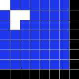

### Color 3

Color 2 is the darker color of the level. Blocks contains the following elements:
* 1px vertical black border on right-most column
* 1px horizontal black border on bottom-most row
* "Shine" on the top-left corner, over a 3x3 area

Here is a sample at level 0:

### Color 1 (white)

Color 1 is the white, and it is a white square with a border of color 2, and a shine pixel on the top-left corner

Here is a sample at level 0:
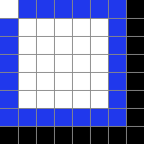

### Pieces

When each block contains its border on the bottom-right, it creates the illusion of a neat consistent spacing in between blocks.

And when pieces are positioned over a black background like the next box or the field itself, contiguous blocks appear nice and neat at 7x7 pixelswith a consistent spacing, like this:

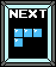

## Scaling at play

When using the native sprite pixel size, the whole Tetris interface is too small on any modern (and even older display) to play comfortably. Here it is below at 1x resolution (256x224)

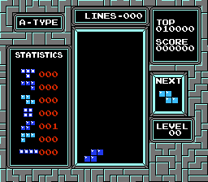

So TVs, emulator, and capture cards scale the native resolution to varying degree of consistency. For example, the UI might be scaled to 640x480 with some pixel sommthing, like this:

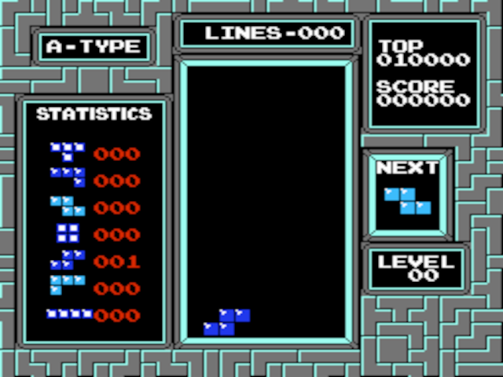

This poses a problem for doing OCR and board and block scanning.

Because bluriness has been added to the image. See the next box scaled up now:

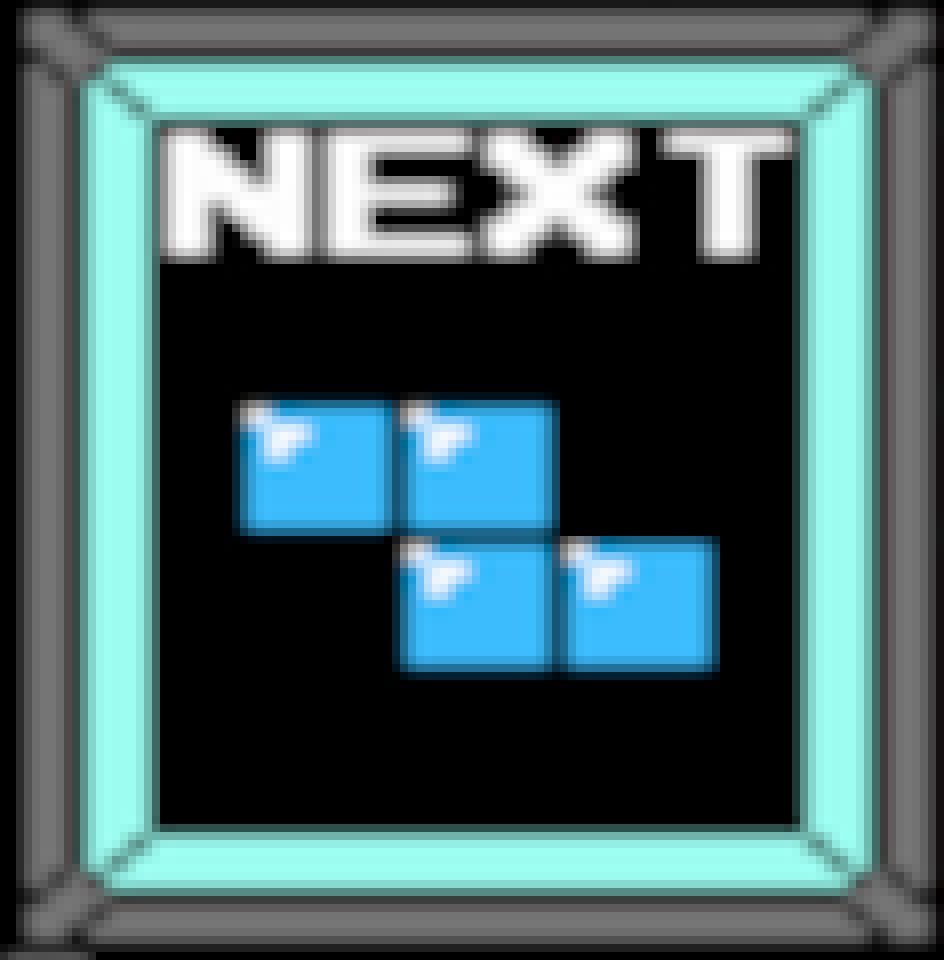

Based on that If we were to try to identify the region of the blocks, how do know what should be included and what should be discarded?

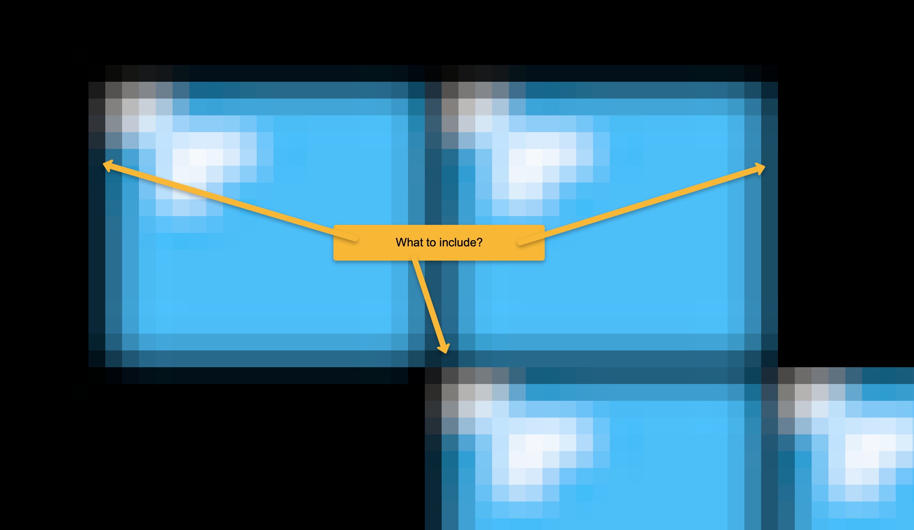

Say we could pick this region:

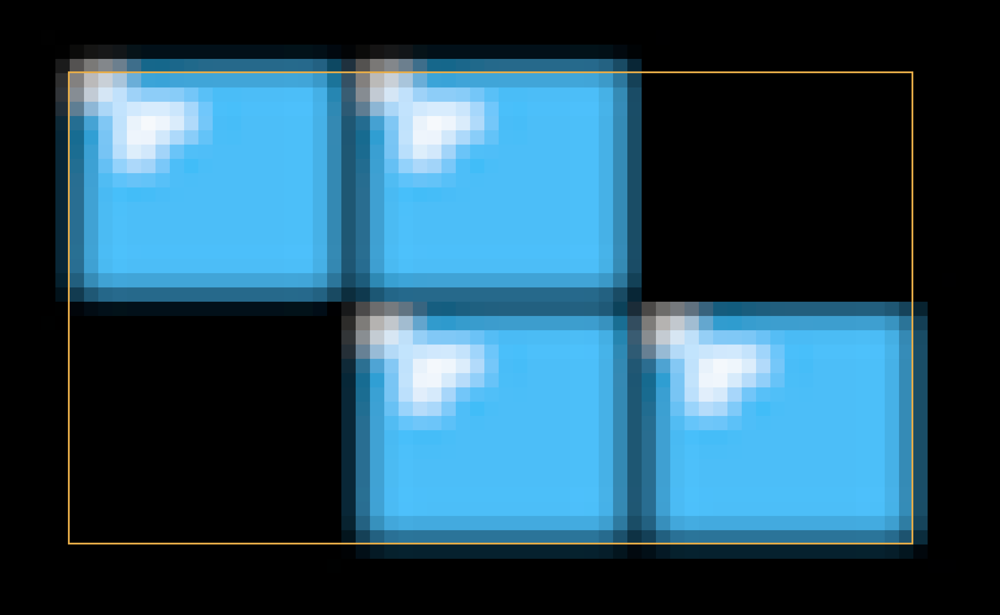

To identify some regions of the image again (shine, border), we might want to scale back to nes pixel size. At NES pixel size, the Z piece here, cropped without its borders should be 23x15 pixel (8+8+7)x(8+7). But where we crop affects the result of normalization scaling. Like this:

Cropped Scaled up copy | Cropped Normalized copy | Cropped copy with region markers
---------------------- | ----------------------- | -----------------------
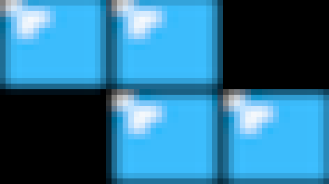 | 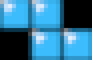 | 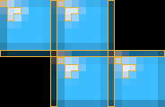
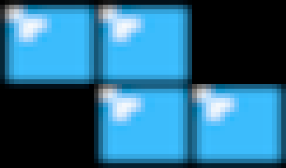 | 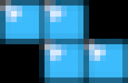 | 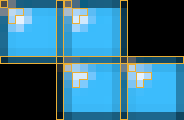

## Frame Scanning

### The Calibration UI

### Notable issues

